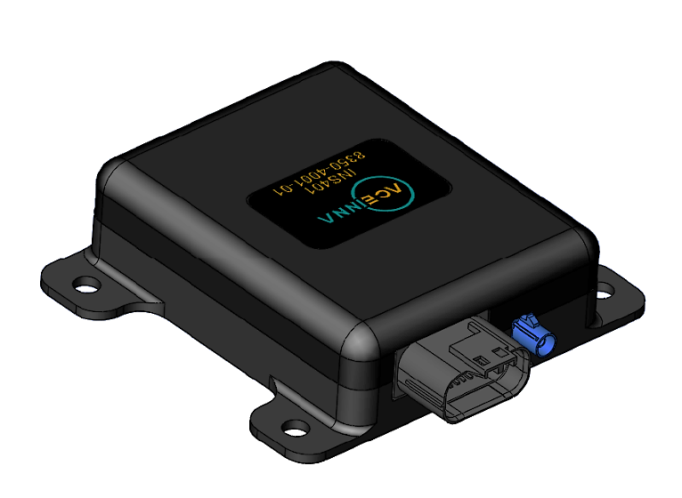
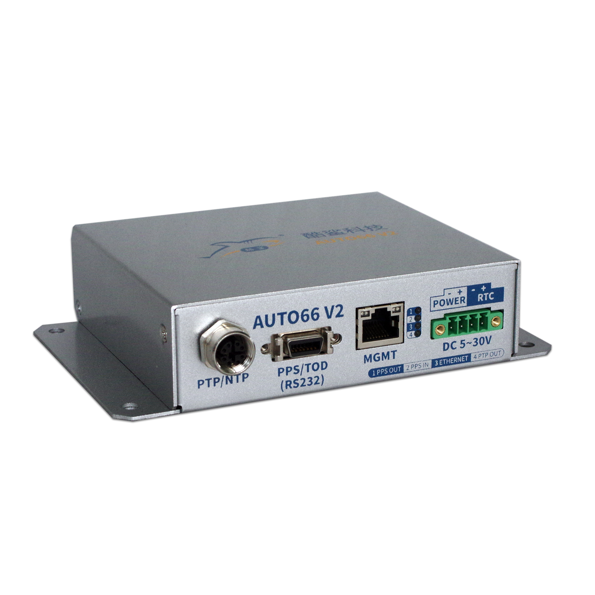
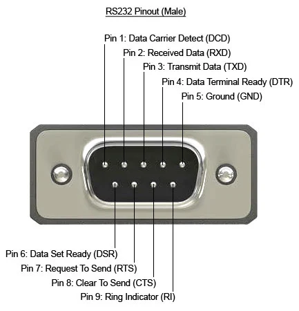
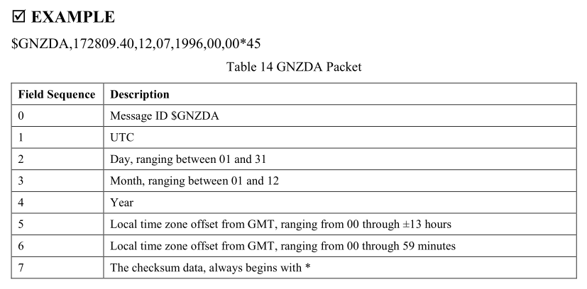

# ToD (Time of Day) Forwarder


A lightweight Linux daemon that discovers [**Aceinna INS401**](https://www.aceinna.com/inertial-systems/INS401) devices over raw Ethernet and forwards their Time-of-Day information to [**CoolShark AUTO66 V2**](https://www.coolshark.com/products/AUTOV3.html) via RS-232 as NMEA time messages.

<div align="center">
  
  
</div>

> [!WARNING]
> This project is a proof-of-concept and is not intended for production use
> without further testing and validation. It is provided "as-is" under the MIT
> License. Use at your own risk.

---

## Table of Contents

- [Overview](#overview)
- [Features](#features)
- [Project Structure](#project-structure)
- [Prerequisites](#prerequisites)
- [Build](#build)
- [Configuration](#configuration)
- [Run](#run)
  - [CLI Usage](#cli-usage)
  - [systemd Service (Autostart Daemon)](#systemd-service-autostart-daemon)
- [Testing](#testing)
  - [Hardware Setup](#hardware-setup)
  - [Build and Run Tests](#build-and-run-tests)
  - [Test Categories](#test-categories)
- [Deployment](#deployment)
- [Known Issues](#known-issues)
- [Contributing](#contributing)
- [License](#license)

---

## Overview

ToD Forwarder operates in one of two forwarding modes:

| Mode | Config Setting | Behavior |
|------|---------------|----------|
| **Direct forward** | `use_gnss_packets = false` | Validates and forwards raw `$--ZDA` NMEA sentences from the INS401 to AUTO66 V2 as-is. |
| **GNSS compensation** | `use_gnss_packets = true` | Decodes binary GNSS solution packets, applies a configurable GPS–UTC leap-second offset, generates `$--ZDA` sentences, and transmits them to AUTO66 V2 over RS-232. |

---

## Features

- **INS401 discovery over Ethernet** — broadcasts a discovery request and listens on all active non-loopback network interfaces.
- **Raw Ethernet parsing** — uses a custom `EthernetSocket` with BPF filtering and INS401 protocol definitions to receive and validate Aceinna Ethernet frames.
- **Flexible time forwarding** — supports both direct NMEA passthrough and GPS-to-UTC converted output (see [Overview](#overview)).
- **Low-latency serial output** — tuned RS-232 sender (`RS232Sender`) with `ASYNC_LOW_LATENCY`, configurable port and baud rate.
- **Graceful lifecycle** — handles `SIGTERM`/`SIGINT` for clean shutdown; auto-rediscovery on device disconnect; restarts on failure as a systemd service.

---

## Project Structure

```
INS401-ToD-Forwarder/
├── include/
│   ├── ethernet_socket.h        # Raw Ethernet socket with BPF and epoll
│   ├── ins401_discover.h        # INS401 device discovery
│   ├── ins401_protocol.h        # Protocol constants and helpers
│   ├── ins401_receiver.h        # GNSS/NMEA frame receiver
│   └── rs232_sender.h           # RS-232 sender + GPS→UTC conversion
├── resource/
├── src/
│   ├── main.cpp                 # Entry point, config parsing, main loop
│   ├── ethernet_socket.cpp
│   ├── ins401_discover.cpp
│   ├── ins401_receiver.cpp
│   └── rs232_sender.cpp
├── tests/
│   └── test_serial_loopback.cpp # Serial loopback test suite (no INS401 needed)
├── 99-tod.rules                 # udev rule for /dev/ttyTOD symlink
├── tod-forwarder.service        # systemd service unit
├── tod-forwarder-config.txt     # Default configuration file
├── Deployment.bash              # One-shot build + deploy script
├── CMakeLists.txt
├── LICENSE
└── README.md
```

---

## Prerequisites

| Requirement | Notes |
|-------------|-------|
| **Linux** | Raw socket support (`AF_PACKET`) is required. Tested on Ubuntu 22.04 / 24.04. |
| **C++17 compiler** | e.g. `g++ >= 7` or `clang++ >= 5` |
| **CMake >= 3.16** | Build system. |
| **Root / `CAP_NET_RAW`** | Required for raw Ethernet sockets at runtime. |
| **systemd + udev** | Required for daemon deployment and stable serial device naming. |

---

## Build

```bash
mkdir -p build && cd build
cmake ..
make -j$(nproc)
```

This produces two executables in the `build/` directory:

| Binary | Purpose |
|--------|---------|
| `tod_forwarder` | Main daemon |
| `test_serial_loopback` | Serial loopback test suite |

---

## Configuration

### `tod_forwarder` Configuration

The application reads a plain-text configuration file. If no path is provided on the command line, it defaults to `../tod-forwarder-config.txt` (relative to the executable itself).

#### Supported Keys

| Key | Type | Default | Description |
|-----|------|---------|-------------|
| `serial_port` | string | `/dev/ttyTOD` | RS-232 device path |
| `baud_rate` | integer | `115200` | Serial baud rate |
| `use_gnss_packets` | `true`/`false` | `false` | Enable GNSS compensation mode |
| `gps_utc_leap_seconds` | integer | `18` | GPS–UTC leap-second offset |

#### Example `tod-forwarder-config.txt`

```ini
# RS-232 output settings
serial_port = /dev/ttyTOD
baud_rate = 115200

# Time-of-Day handling
use_gnss_packets = false
gps_utc_leap_seconds = 18
```

### USB-A to RS-232 (Male DB9) Serial Adapter Configuration

The `tod_forwarder` communicates with the CoolShark AUTO66 V2 time server via an
RS-232 serial connection. A udev rule creates a stable symlink (`/dev/ttyTOD`)
so the device path remains consistent across reboots and re-plugging.

Any USB-to-RS-232 adapter should work. The repository includes an example rule
(`99-tod.rules`) configured for a specific adapter — you will need to update it
to match your own hardware.

#### Setup

1. Identify your adapter's device node by comparing before and after plugging
   it in:

   ```bash
   # Before plugging in
   ls /dev/ttyUSB*

   # Plug in the adapter, then
   ls /dev/ttyUSB*
   ```

   The newly appeared device (e.g. `ttyUSB0`) is your adapter.

2. Query its attributes (replace `ttyUSB0` with your actual device):

   ```bash
   udevadm info -a -n /dev/ttyUSB0 | grep -E "idVendor|idProduct|serial"
   ```

3. Edit `99-tod.rules` with your adapter's values:

   ```
   SUBSYSTEM=="tty", ATTRS{idVendor}=="<your_vendor>", ATTRS{idProduct}=="<your_product>", ATTRS{serial}=="<your_serial>", SYMLINK+="ttyTOD"
   ```

   Common USB-RS-232 chipsets for reference:

   | Chipset             | `idVendor` | `idProduct` |
   |---------------------|------------|-------------|
   | FTDI FT232R         | `0403`     | `6001`      |
   | Silicon Labs CP2102 | `10c4`     | `ea60`      |
   | WCH CH340           | `1a86`     | `7523`      |
   | Prolific PL2303     | `067b`     | `2303`      |

4. Install the rule and verify:

   ```bash
   sudo cp 99-tod.rules /etc/udev/rules.d/99-tod.rules
   sudo udevadm control --reload-rules
   sudo udevadm trigger
   ls -l /dev/ttyTOD
   ```

---

## Run

### CLI Usage

```bash
# Using the default config path
sudo ./build/tod_forwarder

# Using a custom config file
sudo ./build/tod_forwarder /path/to/config.txt
```

**Runtime behavior:**

1. **Discovery loop** — repeatedly broadcasts discovery requests on all active non-loopback interfaces, picks the first discovered INS401 device, and starts an `INSDeviceReceiver` for it.
2. **Forwarding** — depending on `use_gnss_packets`:
   - `true`: parses binary GNSS solution packets and sends generated `$GNZDA` via RS-232.
   - `false`: validates and forwards `$--ZDA` NMEA sentences as-is.
3. **Termination** — press `Ctrl+C` or send `SIGTERM`; the process stops the receiver thread, closes the serial port, and exits cleanly.

### systemd Service (Autostart Daemon)

The repository includes a ready-to-use systemd unit (`tod-forwarder.service`) and a udev rule (`99-tod.rules`). For udev rule setup, see [USB-A to RS-232 Serial Adapter Configuration](#usb-a-to-rs-232-male-db9-serial-adapter-configuration).

**Service unit:**

```ini
[Unit]
Description=INS401 ToD Serial Forwarder for Auto66 V2
After=network.target

[Service]
Type=simple
ExecStart=/opt/tod_forwarder/tod_forwarder /opt/tod_forwarder/tod-forwarder-config.txt
Restart=on-failure
RestartSec=3
StandardOutput=journal
StandardError=journal
AmbientCapabilities=CAP_NET_RAW

[Install]
WantedBy=multi-user.target
```

**Manual service management:**

```bash
sudo systemctl status tod-forwarder.service
sudo systemctl restart tod-forwarder.service
journalctl -u tod-forwarder.service -f
```

---

## Testing

The test suite verifies serial data forwarding correctness **without requiring an INS401 device**. It uses a physical RS-232 loopback to exercise the `RS232Sender` class end-to-end: open/close, raw data integrity, `$GNZDA` generation, GPS-to-UTC conversion, NMEA checksum, and multi-message burst delivery.

### Hardware Setup

```
  Computer USB-A  ──►  USB-A-to-RS-232 (male) Adapter  ──►  RS-232 (male) Connector
                                                   ┌─────────┐
                                                   │ Pin 2 ──┤
                                                   │   ↕     │  (wire jumper)
                                                   │ Pin 3 ──┤
                                                   └─────────┘
```

<div align="center">
  
</div>

- Connect a **USB-A to RS-232 (male)** (DB9) adapter to the computer.
- On the **RS-232 (male) connector**, short **pin 2 (RXD)** to **pin 3 (TXD)** with a wire jumper to form a loopback.
- The adapter typically appears as `/dev/ttyUSB0`.

### Build and Run Tests

```bash
# Build (from repository root)
mkdir -p build && cd build
cmake .. && make -j$(nproc)

# Run with auto-detected port
sudo ./test_serial_loopback

# Or specify the port explicitly
sudo ./test_serial_loopback /dev/ttyUSB0
```

### Test Categories

| # | Category | Tests | What is verified |
|---|----------|-------|------------------|
| 1 | **RS232Sender class** | `open_close`, `open_invalid_port`, `sendraw_edge_cases`, `sendgnzda_closed_port` | Port lifecycle, error handling, edge-case rejection |
| 2 | **Raw data loopback** | `loopback_ascii`, `loopback_all_bytes`, `forward_nmea_sentence` | Byte-level integrity (0x00–0xFF), direct-forward mode simulation |
| 3 | **GNZDA + GPS-to-UTC** | `gps_epoch`, `week2348_leap18`, `week2348_no_leap`, `centiseconds`, `midday`, `end_of_week`, `late_january` | Time conversion correctness, NMEA `$GNZDA` format, checksum, leap-second compensation |
| 4 | **Multi-message** | `multiple_gnzda_burst` (10 msgs), `interleaved_raw_and_gnzda` | Burst delivery, message ordering, no data loss |
| 5 | **Baud rates** | `9600`, `38400`, `115200`, `230400` | Loopback at various serial speeds |
| 6 | **Latency benchmarks** | `latency_sendraw`, `latency_sendgnzda`, `latency_baud_comparison`, `latency_burst` | End-to-end forwarding delay (ms), baud-rate scaling, burst throughput |

### Latency Benchmarks

Category 6 measures real-world forwarding delay through the physical loopback. For detailed methodology (timing model, theoretical wire-time calculations, and baud-rate comparisons), see [`docs/latency-benchmarks.md`](./docs/latency-benchmarks.md).

<details>
<summary>Example test output</summary>

```
============================================================
  ToD Forwarder  -  Serial Loopback Test Suite
  Port: /dev/ttyUSB0
  Hardware: USB-A to RS-232 (male), pin 2 <-> pin 3 loopback
============================================================

-- RS232Sender class tests --
  [TEST] test_sender_open_close                    PASS
  [TEST] test_sender_open_invalid_port             PASS
  [TEST] test_sender_sendraw_edge_cases            PASS
  [TEST] test_sender_sendgnzda_closed_port         PASS
  ...

-- Latency benchmarks --
  [TEST] test_latency_sendraw                      PASS

    SendRaw() latency @ 115200 baud, 38-byte $GNZDA:
    First byte arrival:                  min=   3.50  avg=   4.12  med=   3.98  max=   6.21 ms  (50 samples)
    Full message round-trip:             min=   4.80  avg=   5.35  med=   5.20  max=   7.60 ms  (50 samples)
    Theory wire time (1-way, 8N1):       3.30 ms  (38 bytes * 10 bits / 115200 baud)

  [TEST] test_latency_baud_comparison              PASS

    Baud rate comparison – SendGNZDA() first-byte latency (8N1 framing):
    Baud          Min      Avg   Median      Max   Theory(1-way)
    ────────── ──────── ──────── ──────── ────────  ─────────────
    9600        40.10    41.25    40.85    43.70     39.58 ms
    38400       10.50    11.20    11.05    13.10      9.90 ms
    115200       3.50     4.10     3.95     6.20      3.30 ms
    230400       2.00     2.55     2.40     4.10      1.65 ms
  ...

============================================================
  Results:  25 passed,  0 failed,  25 total
============================================================
```

</details>

---

## Deployment

> **Important:** Before deploying, ensure you have configured `99-tod.rules`
> for your USB-RS-232 adapter. See
> [USB-A to RS-232 Serial Adapter Configuration](#usb-a-to-rs-232-male-db9-serial-adapter-configuration).

The `Deployment.bash` script performs a complete one-shot build and install:

```bash
sudo ./Deployment.bash
```

**What it does:**

1. Cleans and rebuilds the project with CMake.
2. Installs the udev rule `99-tod.rules` to `/etc/udev/rules.d/` and reloads udev so `/dev/ttyTOD` appears.
3. Copies the binary to `/opt/tod_forwarder/` and sets the `CAP_NET_RAW` capability.
4. Copies the default config `tod-forwarder-config.txt` to `/opt/tod_forwarder/`.
5. Installs, enables, and starts the `tod-forwarder.service` systemd unit.

**Post-deployment verification:**

```bash
ls -l /dev/ttyTOD
sudo systemctl status tod-forwarder.service
journalctl -u tod-forwarder.service -f
```

After this, ToD Forwarder starts automatically at boot and uses `/dev/ttyTOD` as its RS-232 output port.

---

## Known Issues

### `$GNZDA` Sentence Compatibility with INS401

The `$GNZDA` sentences output by the INS401 differ slightly from the standard NMEA-0183 format. Although the [INS401 User Manual](./resource/7430-4006-02_B_D8_INS401_UserManual.pdf) (accessed 2025-02-25 from [Aceinna official product page](https://navview.blob.core.windows.net/web-resources/7430-4006-02_B_D8_INS401_UserManual.pdf?_t=1720528226863); version: 7430-4006-02_B) documents the standard-compliant format, the actual output contains an additional comma before the checksum field, which may cause certain NMEA parsers to reject the sentence as malformed.

<div align="center">
  
  <br>
  <em>Page 23 of Document Part Number: 7430-4006-02_B</em>
</div>

The expected NMEA-0183 `$--ZDA` format (see [Trimble NMEA-0183 reference of ZDA](https://receiverhelp.trimble.com/alloy-gnss/en-us/NMEA-0183messages_ZDA.html)):

```
$GNZDA,hhmmss.ss,dd,mm,yyyy,xx,yy*cc
```

Actual output from the INS401:

```
$GNZDA,hhmmss.ss,dd,mm,yyyy,xx,yy,*cc
                                 ^ extra comma
```

Users who rely on strict NMEA parsers should be aware of this discrepancy. In this project, since the AUTO66 V2 receives standard-compliant `$--ZDA` sentences, we applied a simple fix to normalize the INS401 output to match the expected format.

---

## Contributing

Issues and pull requests are welcome.

---

## License

This project is licensed under the MIT License. See the [LICENSE](./LICENSE) file for details.
